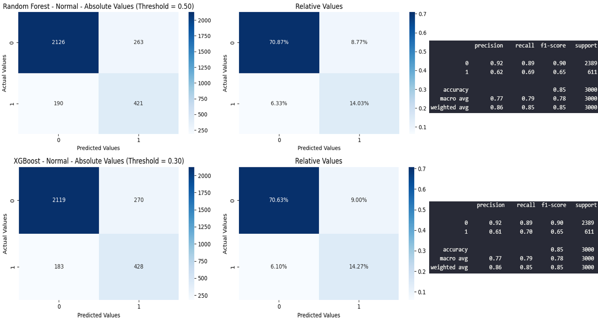

# [Clients Churn Prediction](https://clientchurnpred.azurewebsites.net/)


## Dataset
The dataset for this project was given by Incidium, and is about client data and if they exited the financial institution or not.
It consists of 10000 rows with 13 columns:
- RowNumber: Indicates the row number
- CustomerId: The client ID
- Surname: The clients surname
- CreditScore: The clients credit score
- Geography: The clients country
- Gender: The clients gender
- Age: The clients age
- Tenure: Indicates the amount of time the client has been with the institution
- Balance: Balance or value associated with the clients account
- NumOfProducts: The number of products the client has
- HasCrCard: If the client owns or not a credit card
- IsActiveMember: If the client is an active member or not
- EstimatedSalary: The clients estimated salary

### Target
- Exited: If the client churned or not (binary classification problem)

## Objectives
The main objective of this project is:

**To develop a predictive model capable of generating predictions regarding client churn. A new dataset containing the columns: rowNumber and predictedValues must be created, with predictedValues showing if the client will churn or not**

To achieve this objective, it was further broken down into the following technical sub-objectives:

1. To clean the dataset if needed
2. To perform in-depth exploratory data analysis of the dataset
3. To perform feature engineering
4. To develop a supervised model to predict the chances of churn
5. To put the model into production with a web app

## Main Insights
From the exploratory data analysis, these were the main points that stood out:
- `Exited` is very unbalanced, with almost 80% of all data concentrated on the 0 class


- `NumOfProducts` is extremely unbalanced and the churn rate per value is non-linear. 1 and 2 products compose 95% of `NumOfProducts` data


- `CreditScore`, `Tenure` and `EstimatedSalary` show the same behavior in relation to the target for all values and when plotted with all categorical features


- `Age` shows that older clients, around 40-50 years old, have a higher churn rate. This feature appears to be very useful for the model


- Around 32% of clients from Germany have churned. This is double the churn rate in relation to the other two countries


- Inactive members have a churn rate of almost double of the active ones


- 2 products is the absolute ideal number for clients to have, since almost no client with 2 products decides to leave the institution. Clients with 3 or more product have an extremely high churn rate, but there are few clients in this zone. Another big issue is that there are a lot of clients with only 1 product, but the churn rat for them is relatively high


- `Geography` shows an interesting behavior with `Balance` in relation to the target. Clients from Germany that churn, all have a balance above zero


To see the complete EDA, please check the [Exploratory Data Analysis Notebook](https://github.com/vitorccmanso/Churn-Prediction/blob/main/Notebooks/EDA.ipynb).

## Feature engineering
During feature engineering, `NumOfProducts` was transformed be used as a categorical feature. The values have a natural order, but they don't have a consistent relation with the target. Also, since all clients with 4 products have churned, the percentage for 3 products is very high and there are very few clients with 3 and 4 products, this can create a small bias to the model. To mitigate this, 3 and 4 products were combined into the same category "3 or more", reducing the potential bias from the perfect correlation of 4 products - 100% chance of churn.

In adition to this, all numerical columns were analyzed to see if any transformation (log or cubic) would help to transform their distributions into more closely resembling a normal one, since scaling techniques and certain models tend to perform better with normally distributed data.

To finish this step, two training datasets were created, with only one of them having the numerical features `CreditScore`, `Tenure` and `EstimatedSalary`. This way, the relevance of the features for the models will be measured and compared.

To see the complete Feature Engineering step, please check the [Feature Engineering Notebook](https://github.com/vitorccmanso/Churn-Prediction/blob/main/Notebooks/Feature%20Engineering.ipynb).

## Models
For the modeling phase, four models were used: Logistic Regression, Random Forest, XGBoost and SVM. This combination of models allows for comparisons between both simple and complex approaches to find the best solution for the churn prediction.

During each training and testing, two methods were used to solve the imbalance issue of the target. The first one was using the parameter `class_weight` on the models. The second method was the utilization of `SMOTE`, an oversampling method that uses synthetic data to balance the target. `SMOTE` will only be applied to the training sets, with the test sets having the original imbalance of the data.

After the models were trained and tested, they were evaluated in terms of the metrics `Recall`, `Precision`, `f1` and `ROC-AUC`. `f1` and `Recall` are the most important metrics here, since the primary goal is churn prediction. `Recall` will measure the proportion of true positives out of the actual positives, with a high recall consisting of a low number of false negatives. `Precision` will measure the proportion of positive predictions that are actually correct, with fewer false positives indicating a higher precision. `f1` will be the harmonic average between them, and `ROC-AUC` will evaluate the model's ability to discriminate the data between the two classes.

For this analysis, it was presumed that the cost of a false negative (client that churned, and the model said it wouldn't) is way higher than the cost of a false positive (client that the model said it would churn, but it didn't). The reason is that it's way more expensive to attract and maintain a new client than it is to keep an already existing client happy.

A high `Recall` is important, since a low number of false negatives indicates a low chance of missing a client that actually left the institution. But this is useless if the precision is extremely low. Because of this, both `Recall` and `f1` will be the focus of the model training. They will be used as the scoring metrics to evaluate the models and `f1` will be used to refit the best model.

To train the models, `RandomSearchCV` was used to fine tune them and use cross-validation. Also, a [repo in DagsHub](https://dagshub.com/vitorccmanso/Case-Indicium/experiments) was used, along with MLflow to keep track of all the information about the models.

To see the complete Model Training step, please check the [Model Training Notebook](https://github.com/vitorccmanso/Churn-Prediction/blob/main/Notebooks/Model%20Training.ipynb).

### Model performance and Selection
After all four trainings were complete (dataset with all features or not, and smote applied or not), two models were the clear best performers, with a low number of errors (false positives + false negatives) and good values for `f1`, `Recall` and `Precision`. They were the **Random Forest** trained with the dataset containing all features and without `SMOTE`, and the **XGBoost** trained with the reduced features dataset and without `SMOTE`.


The XGBoost, in a first glance, seems like a bad model, but a threshold analysis shows that by changing the model's threshold to around 0.3, there would be a massive increase in `Recall` and a clear increase in `f1`. With that, the confusion matrices of both models were plotted, together with their classification reports, with the threshold of the **XGBoost** model changed to 0.3.



As the analysis and reports demonstrate, the XGBoost model with a threshold of 0.3 is the best choice for this project, even though its performance is only slightly better than the Random Forest model. While both models achieved the same `f1-score`, some factors make XGBoost the preferred option:
- Minimizing False Negatives: It’s more expensive for the institution to attract and maintain new clients than to keep existing ones. Since XGBoost results in fewer false negatives, it’s better aligned with the goal of retaining clients
- Simpler Model with Fewer Features: The XGBoost model, trained on a reduced set of features, delivers strong results while requiring less data. This not only makes the model easier to interpret and faster to run
- Better Alignment with Business Priorities: By adjusting the threshold to 0.3, the model is tuned to the institution’s focus on balancing precision and recall, ensuring predictions are more useful for decision-making

The model parameters are:

```json
{
    n_estimators: 150,
    max_depth: 5,
    learning_rate: 0.1,
    class_weight: "balanced"
    random_state: 42
}
```

### Model Explainability


When plotting the feature importance for the best model, it's possible to see that `Age` is the most important one, with a decay in `f1` above 0.2 when its values are randomly permuted. The model has 6 features that really important, with all the others giving a very small contribution to the model.

Additionally, an analysis using SHAP was made, to see the impact of feature values on the prediction of the model


Using this graph, it's possible to see how each feature contributed to the model's predictions. The colors change depending on the value of the feature, with higher values being red and lower values being blue. With this, the x-axis shows the impact of that value on the model output. From this, it's possible to draw a few conclusions:
- Older clients tend to leave the institution
- Clients with exactly two products like to stay in the institution
- Inactive clients are the ones leaving
- Higher balance indicates a higher churn chance
- Women have a tendency to leave the institution
- Clients from Germany tend to churn

Almost all of these points were already found during the EDA, and are now proven. The only different point is that, for the model, inactive members tend to churn more than active ones, and in the EDA, the contrary was found. Maybe the model is capturing some non-linear relation between this feature and others or that inactivity, in certain scenarios, is more predictive of churn.

Also, by using the `force_plot` function, it was possible to see how the features impacted specific predictions:


For this client, the model said that there's only a 10% chance of churn. This result is based on features values and its impact. `NumOfProducts_2` was the most important feature here, showing that this client owns two products. Also, the client has no balance, is middle-aged, is a man and is an active member. All of this is in line with findings from the EDA and from the summary graph on how the features impact the models decision.


For this client, there's a 96% chance of churn. The client is very old, is not an active member and doesn't own two products, with the only thing preventing this from being a 100% chance of churn being the fact that the client is a man, the gender who tends to stay with the institution.

## App Usage

The easiest way to use the app is by accessing this link: <https://clientchurnpred.azurewebsites.net/>

However, since the deployment was made with the free plan from Azure, which only gives 60min of usage per day, the other way is through a Docker image or running with uvicorn. Here is a step by step guide on how to create and run this image and how to run the app locally through uvicorn:

### Docker Image
### Step 1: Build Docker Image

The easiest way to build and run a docker image is with Docker Desktop. It can be downloaded [here](https://www.docker.com/products/docker-desktop/).
Clone this repository and go to the folder with the Dockerfile. Then, run the following command to build the image:

```shell
docker build -t client_churn_pred .
```

To check if the image was created successfully, run `docker images` in your CLI and you should see `client_churn_pred` listed.

### Step 2: Run Docker Image

In the same CLI, run the following command to run the image:

```shell
docker run -p 80:80 client_churn_pred
```

You should see something like this:

```shell
INFO:     Started server process [1]
INFO:     Waiting for application startup.
INFO:     Application startup complete.
INFO:     Uvicorn running on http://0.0.0.0:80 (Press CTRL+C to quit)
```

Open a web browser page and type `localhost` in the search bar. The app should load and be ready for use. Use the test  dataset **Abandono_teste.csv** in the folder `Data` (inside the `Notebooks` folder) to test the `Predict with Dataset` function.

## Running locally trough uvicorn (this assumes that you have python installed)
### Step 1: Install libraries

Clone or download this repository, then go to the app folder of the project (where requirements_app.txt is). Open a command prompt in this folder and run this command:

```shell
pip install -r requirements_app.txt
```

### Step 2: Run the app

On the same command prompt, run the following command to run the app:

```shell
uvicorn app.main:app --reload
```

You should see something like this:

```shell
INFO:     Uvicorn running on http://127.0.0.1:8000 (Press CTRL+C to quit)
INFO:     Started reloader process [18496] using StatReload
INFO:     Started server process [1344]
INFO:     Waiting for application startup.
INFO:     Application startup complete.
```

Copy the adress that the app is running, in this case `http://127.0.0.1:8000` and open it on a web browser, or simply type in the browser `localhost:8000`. The app should load and be ready for use. Use the dataset **Abandono_teste.csv** in the folder `Data` (inside the `Notebooks` folder) to test the `Predict with Dataset` function.
